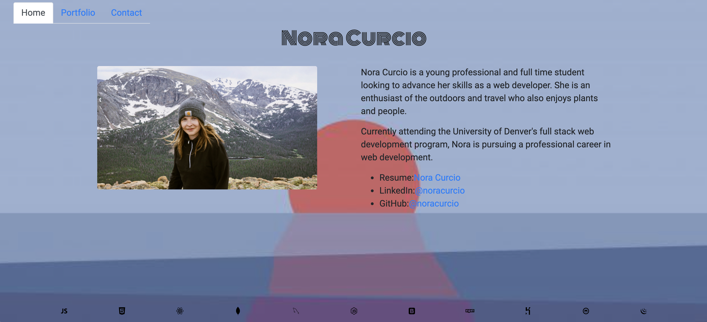
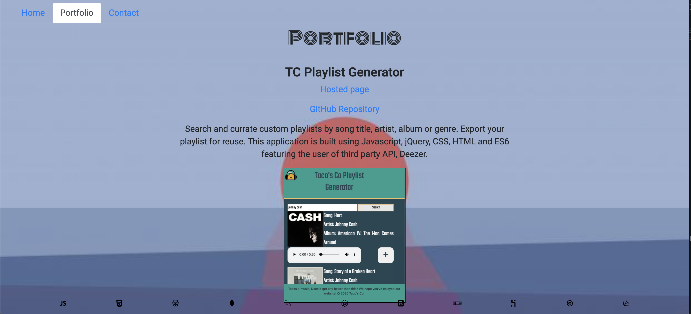
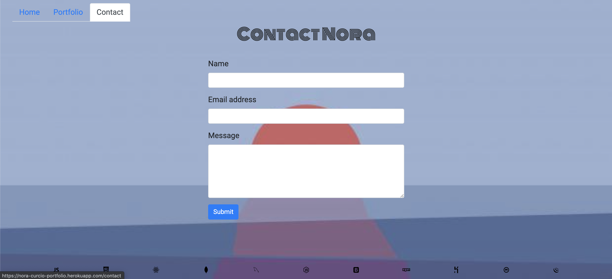

# Nora Curcio's React Portfolio

## Description

This portfoliio is created with React and highlights Nora's accomplishments as a Web Developer

## Table of Contents

- [Installation](#installation)
- [Usage](#usage)
- [Credits](#credits)
- [License](#license)
- [Future-Development](#future-development)
- [Technologies-Used](#technologies-used)
- [Heroku](#heroku)
- [Questions](#questions)

## Installation

Steps to install project include:

- npm install the dependencies

## Usage

## 

## 

## 

## Credits

All of the code was developed by:

- Nora Curcio
  - GitHub Username: noracurcio
  - GitHub Profile: https://github.com/noracurcio)

## License

This project is licensed under MIT.

## Future-Development

N/A

## Technologies-Used

ReactJS, CSS, HTML, Bootstrap, Heroku, NodeJS, Express

## Heroku

This application is deployed on Heroku and can be found at the following link: (https://nora-curcio-portfolio.herokuapp.com/)

## Questions

Please contact noracurcio@gmail.com regarding any questions.

Github username: noracurcio
